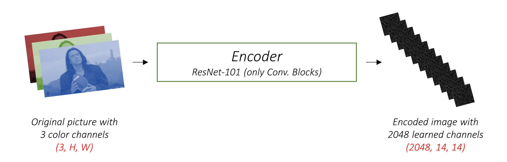
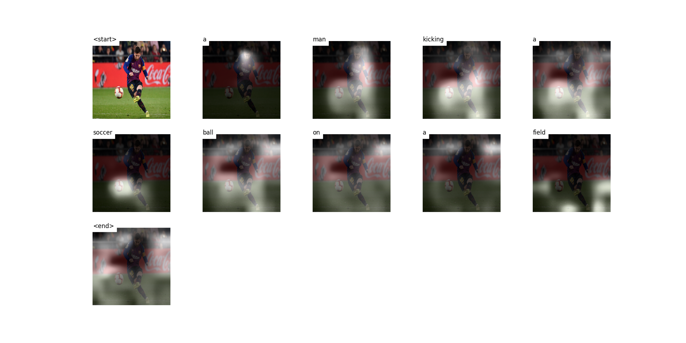

---
# try also 'default' to start simple
theme: seriph
# random image from a curated Unsplash collection by Anthony
# like them? see https://unsplash.com/collections/94734566/slidev
background:
# apply any windi css classes to the current slide
class: 'text-center'
position: 'center'
# https://sli.dev/custom/highlighters.html
highlighter: shiki
# show line numbers in code blocks
lineNumbers: false
# some information about the slides, markdown enabled
info: |
  ## Slidev Starter Template
  Presentation slides for developers.

  Learn more at [Sli.dev](https://sli.dev)
# persist drawings in exports and build
drawings:
  persist: true
---

# Báo cáo bài tập cuối kỳ
## Nhóm 6
## Đề tài: Ứng dụng Deep Learning xây dựng phần mềm tự động sinh mô tả ảnh
Thành viên: - Nguyễn Chí Thanh
            - Đoàn Đại Thanh Long
            - Lê Thị Thắm

<style>
h1 {
  background-color: #2B90B6;
  font-size: 12px;
  background-image: linear-gradient(45deg, #4EC5D4 10%, #146b8c 20%);
  background-size: 100%;
  -webkit-background-clip: text;
  -moz-background-clip: text;
  -webkit-text-fill-color: transparent;
  -moz-text-fill-color: transparent;
}
</style>

---

<style>
h1 {
  background-color: #2B90B6;
  background-image: linear-gradient(45deg, #4EC5D4 10%, #146b8c 20%);
  background-size: 100%;
  -webkit-background-clip: text;
  -moz-background-clip: text;
  -webkit-text-fill-color: transparent;
  -moz-text-fill-color: transparent;
  -font-size: 20px;
}
</style>

# MỤC LỤC

## 1. Tổng quan Image Captioning
## 2. Chi tiết phương pháp
## 3. Phương pháp đánh giá
## 4. Thực nghiệm và kết quả
## 5. Demo giao diện
## 6. Hướng phát triển đề tài

---

# 1. Tổng quan Image Captioning

- Định nghĩa: Image Captioning là một bài toán miêu tả nội dung của một ảnh dựa vào ngôn ngữ tự nhiên.

- Ý nghĩa bài toán: 
  - Để giúp những người già mắt kém hoặc người mù có thể biết được cảnh vật xung quanh hay hỗ trợ việc di chuyển
  - Giúp google search có thể tìm kiếm được hình ảnh dựa vào caption

- Image Captioning là một trong những vision-language model phổ biến cùng với:
  - Visual Question Answering
  - Text-Image Retrieval
  - Visual Grounding
  - Scene-Graph Generation

---

# 1. Tổng quan Image Captioning

- Kiến trúc tổng quát của một model dịch máy:


---

# 1. Tổng quan Image Captioning

- Kiến trúc tổng quát của một model Image Captioning:


- Gồm hai thành phần chính: Encoder và Decoder
- Kiến trúc chung kế thừa chủ yếu từ bài toán dịch máy
- Ở giữa encoder và decoder thường có thành phần attention để kết nối.


---

# 2. Chi tiết phương pháp


- Mô hình nhận input là một ảnh và tạo ra một mô tả là chuỗi mà một vị trí trong chuỗi được chọn từ $K$ từ (từ điểm gồm $K$ từ)

$$\bold{y} = \lbrace \bold{y}_1, \dots, \bold{y}_C \rbrace, \bold{y}_i \in \mathbb{R}^K$$

với:
- $K$ là số từ trong từ điển
- $C$ là độ dài của câu mô tả

## 2.1. Encoder

- Encoder thường là một CNN

- Encoder nhận đầu vào là một ảnh và tạo ra một tập các vector đặc trưng được gọi là vector gán nhãn


---

# 2. Chi tiết phương pháp


## 2.1. Encoder

- Giả sử encoder tạo ra tập gồm $L$ vector, mỗi vector có $D$ chiều

$$\bold{a}=\lbrace \bold{a}_1, \dots, \bold{a}_L \rbrace, \bold{a}_i \in \mathbb{R}^D$$



- $L=196$, $D=2048$

---
layout: two-cols
---

# 2. Chi tiết phương pháp


## 2.2. Decoder

- Kiến trúc Decoder:


::right::

- Các bước tạo mô tả:

1. Từ $\bold{a}$, tạo ra trạng thái ẩn ban đầu cho Decoder $\bold{h}_0$ và $\bold{c}_0$

2. Từ $\bold{a}$ và $\bold{h}_{t-1}$ tạo ra attention map $\alpha_t$

3. Tính vector bối cảnh $\hat{\bold{z}}_t$ từ $\bold{a}$ và 
$\alpha_t$

4. Ghép embedding $\bold{Ey}_{t-1}$ với $\hat{\bold{z}}_t$ làm đầu vào cho Decoder

5. Dự đoán đầu ra

6. Quay lại 2. đến khi gặp đầu ra là từ "end"

---
layout: two-cols
---

# 2. Chi tiết phương pháp


## 2.2. Decoder

- Decoder sử dụng cấu trúc LSTM:


::right::

$$\begin{bmatrix}
    \bold{i}_t \\
    \bold{f}_t \\
    \bold{o}_t \\
    \bold{g}_t
\end{bmatrix}=\begin{bmatrix}
    \sigma \\
    \sigma \\
    \sigma \\
    \mathrm{tanh}
\end{bmatrix}W_{\mathrm{LSTM}}\begin{bmatrix}
    \bold{h}_{t-1} \\
    \bold{x}_t
\end{bmatrix}$$

$$\bold{c}_t = \bold{f}_t \odot\bold{c}_{t-1} + \bold{i}_t \odot \bold{g}_t$$

$$\bold{h}_t = \bold{o}_t \odot \mathrm{tanh}(\bold{c}_t)$$

- Với $\bold{i}_t, \bold{f}_t, \bold{c}_t, \bold{o}_t, \bold{h}_t$ lần lượt là cổng vào, cổng quên, cổng bộ nhớ trạng thái, cổng đầu ra và trạng thái ẩn của LSTM.

- $\sigma$ và $\odot$ lần lượt là hàm sigmoid và phép nhân từng phần tử của hai ma trận

---
layout: two-cols
---

# 2. Chi tiết phương pháp


## 2.2. Decoder

- Cấu trúc LSTM trong phương pháp:


::right::

$$\begin{bmatrix}
    \bold{i}_t \\
    \bold{f}_t \\
    \bold{o}_t \\
    \bold{g}_t
\end{bmatrix}=\begin{bmatrix}
    \sigma \\
    \sigma \\
    \sigma \\
    \mathrm{tanh}
\end{bmatrix}T_{D+m+n,n}\begin{bmatrix}
    \bold{h}_{t-1} \\
    \bold{Ey}_{t-1} \\
    \hat{\bold{z}}_t
\end{bmatrix}$$

$$\bold{c}_t = \bold{f}_t \odot\bold{c}_{t-1} + \bold{i}_t \odot \bold{g}_t$$

$$\bold{h}_t = \bold{o}_t \odot \mathrm{tanh}(\bold{c}_t)$$

- Với $\hat{\bold{z}}_t \in \mathbb{R}^D$ là vector bối cảnh, lưu giữ thông tin về một khu vực cụ thể trong ảnh.

- $\bold{E} \in \mathbb{R}^{m\times K}$ là ma trận embedding của từ điển

- $m$ và $n$ là số chiều embedding và số chiều của LSTM

---

# 2. Chi tiết phương pháp


## 2.2. Decoder

- Khởi tạo $\bold{h}_0$ và $\bold{c}_0$

$$\bold{h}_0 = f_{\mathrm{init, h}}\big(\dfrac{1}{L}\sum_i^L\bold{a}_i\big)$$

$$\bold{c}_0 = f_{\mathrm{init, c}}\big(\dfrac{1}{L}\sum_i^L\bold{a}_i\big)$$

- Đầu ra tính xác suất chọn một từ:

$$p\big(\bold{y}_t\vert \bold{a}, \bold{y}_1^{t-1}\big) \propto \exp\big( \bold{L}_0(\bold{Ey}_{t-1} + \bold{L}_h\bold{h}_t + \bold{L}_z \hat{\bold{z}}_t) \big)$$

$$\bold{L}_0 \in \mathbb{R}^{K\times m}$$

$$\bold{L}_h \in \mathbb{R}^{m\times n}$$

$$\bold{L}_z \in \mathbb{R}^{m\times D}$$

<style>
  .katex{font-size: 1.0em;}
</style>

---

# 2. Chi tiết phương pháp


## 2.3. Attention

- $\bold{a}_i$ và $\bold{h}_{t-1}$ được sử dụng để tạo ra attention map:

$$e_{ti}=f_{\mathrm{att}}(\bold{a}_i, \bold{h}_{t-1})$$

$$\alpha_{ti}=\dfrac{\exp(e_{ti})}{\displaystyle\sum_{k=1}^L \exp(e_{tk})}$$

---

# 2. Chi tiết phương pháp


## 2.3. Attention

### 2.3.1. Hard Attention

- Gọi $s_t$ là biến vị trí mà model tập trung vào tại từ thứ $t$. $s_{t,i}$ là một biến one-hot là 1 nếu vị trí thứ $i$ trong $L$ được model chọn để tạo ra từ thứ $t$

$$p(s_{t, i}=1 \vert s_{j < t}, \bold{a})=\alpha_{t,i}$$

$$\hat{\bold{z}}_t = \sum_i s_{t,i}\bold{a}_i$$

- Ta định nghĩa hàm mục tiêu $L_s$ là một hàm cận dưới biến phân trên hàm log-likelihood cận biên $\log p (\bold{y} \vert \bold{a})$:

$$L_s = \sum_s p(s\vert \bold{a}) \log p(\bold{y}\vert s, \bold{a})\\\leq \log \sum_s p(s \vert \bold{a}) p (\bold{y} \vert s, \bold{a})\\=\log p (\bold{y} \vert \bold{a})$$

<style>
  .katex{font-size: 1.1em;}
</style>


---

# 2. Chi tiết phương pháp


## 2.3. Attention

### 2.3.1. Hard Attention

- Với $W$ là trọng số của mô hình, đạo hàm riêng của $L_s$ theo $W$:

$$\dfrac{\partial L_s}{\partial W}=\sum_s p(s \vert \bold{a}) \Big\lbrack \dfrac{\partial \log p(\bold{y} \vert s, \bold{a})}{\partial W} + \log p(\bold{y} \vert s, \bold{a}) \dfrac{\partial p(s \vert \bold{a})}{\partial W} \Big\rbrack)$$

- $s_t$ tuân theo phân phối Multinoulli:

$$\tilde{s}_t \sim \mathrm{Multinoulli}_L \big(\lbrace \alpha_i \big\rbrace)$$

$$\dfrac{\partial L_s}{\partial W} \approx \dfrac{1}{N}\sum_{n=1}^N \Big\lbrack \dfrac{\partial \log p(\bold{y} \vert \tilde{s}^n, \bold{a})}{\partial W} + \log p(\bold{y} \vert \tilde{s}^n, \bold{a}) \dfrac{\partial p(\tilde{s}^n \vert \bold{a})}{\partial W} \Big\rbrack)$$


---

# 2. Chi tiết phương pháp


## 2.3. Attention

### 2.3.1. Hard Attention

- Quá trình lấy mẫu $s_t$ khiến gradient của $L_s$ theo $W$ có phương sai lớn, để giảm phương sai sử dụng phương pháp REINFORCE trong học tăng cường:

$$\dfrac{\partial L_s}{\partial W}=\dfrac{1}{N}\sum_{n=1}^N \Big\lbrack \dfrac{\partial \log p(\bold{y} \vert \tilde{s}^n, \bold{a})}{\partial W} + \lambda_r (\log p(\bold{y} \vert \tilde{s}^n, \bold{a}) - b)\dfrac{\partial p(\tilde{s}^n \vert \bold{a})}{\partial W} + \lambda_e \dfrac{\partial H \lbrack \tilde{s}^n \rbrack}{\partial W} \Big \rbrack $$


---

# 2. Chi tiết phương pháp


## 2.3. Attention

### 2.3.2. Soft Attention

- Với soft attention, kỳ vọng của $\hat{\bold{z}}_t$ có thể tính trực tiếp:

$$\mathbb{E}_{p(s_t \vert a)}\lbrack \hat{\bold{z}}_t \rbrack=\sum_{i=1}^L \alpha_{t,i}\bold{a}_i$$

- Công thức logit đầu ra của Decoder có dạng:

$$\bold{n}_t = \bold{L}_0(\bold{Ey}_{t-1} + \bold{L}_h\bold{h}_t + \bold{L}_z \hat{\bold{z}}_t)$$

$\bold{n}_{t,i}$ là $\bold{n}_t$ khi thay $\hat{\bold{z}}_t=\bold{a}_i$

---

# 2. Chi tiết phương pháp


## 2.3. Attention

### 2.3.2. Soft Attention

- Ta định nghĩa hàm trung bình hình học có trọng số được chuẩn hóa:

$$\mathrm{NWGM}\lbrack p(y_t=k\vert a) \rbrack=\dfrac{\displaystyle \prod_i \exp\big( n_{t, k, i} \big)^{p(s_{t,i}=1\vert a)}}{\displaystyle \sum_j \prod_i \exp\big( n_{t, j, i} \big)^{p(s_{t,i}=1\vert a)}}=\dfrac{\exp\big( \mathbb{E}_{p(s_t \vert a)} \lbrack n_{t,k} \rbrack  \big)}{\displaystyle \sum_j \exp \big(\mathbb{E}_{p(s_t \vert a)} \lbrack n_{t,j} \rbrack \big)}\approx \mathbb{E} \lbrack p(y_t=k \vert a)\rbrack$$

---

# 2. Chi tiết phương pháp


## 2.3. Attention

### 2.3.2. Soft Attention

- Mô hình được học bằng cách cực tiểu hóa hàm mục tiêu:

$$L_d=-\log\big( P(\bold{y} \vert \bold{x}) \big) + \lambda \sum_{i=1}^L (1-\sum_{t=1}^C \alpha_{ti})^2$$

- Thực tế $\hat{\bold{z}}_t$ được nhân thêm một hệ số $\beta_t$:

$$\hat{\bold{z}}_t=\beta_t \sum_{i=1}^L \alpha_{ti} \bold{a}_i=\sigma(f_{\beta_t(\bold{h}_{t-1})})\sum_{i=1}^L \alpha_{ti} \bold{a}_i$$


---

# 2. Chi tiết phương pháp


## 2.3. Attention

- So sánh hai phương pháp:

||Hard Attention|Soft Attention|
|----|----|----|
|Ưu điểm|- Khi tính toán inference sẽ nhanh|Tính đạo hàm dễ dàng|
|Nhược điểm|- Phương sai của gradient lớn, tính đạo hàm khó khăn|Tính toán lâu với ảnh có kích thước lớn|


---
#  3. Phương pháp đánh giá

- Phương pháp hay được sử dụng để đánh giá các bản dịch là BLEU Score.

- BLEU (BiLingual Evaluation Understudy) là một số nằm giữa 0 và 1 đo lường độ tương tự giữa các bản dịch máy với một tập các bản dịch mẫu có chất lượng cao.

- BLEU score cũng có thể được sử dụng cho các bài toán sinh văn bản:
  - Language Generation
  - Image Captioning
  - Text Summarization
  - Speech To Text

- BLEU score được tính dựa trên số lượng n-grams giống nhau giữa câu được do model sinh ra và các câu dịch mẫu (có xét đến yếu tố độ dài)

---

# 3. Phương pháp đánh giá

## 3.1. N-grams

- N-grams là một khái niệm được sử dụng rất nhiều trong xử lý ngôn ngữ tự nhiên. Là một tập gồm n các từ liên tiếp nhau trong một câu

- Ví dụ, trong câu "Học cao học rất khó", các n-grams có thể có:

  - 1-gram (unigram): "Học", "cao", "học", "rất", "khó"
  - 2-gram (bigram): "Học cao", "cao học", "học rất", "rất khó"
  - 3-gram (trigram): "Học cao học", "cao học rất", "học rất khó"
  - 4-gram: "Học cao học rất", "cao học rất khó"


---

# 3. Phương pháp đánh giá

## 3.2. Precision

- Độ đo đo lường số lượng từ xuất hiện trong câu được mô hình dịch cũng xuất hiện 

- Ví dụ:
  - Câu mẫu: "Tôi đang học cao học"
  - Câu dự đoán: "Tôi đang học thạc sỹ"

Precision = Số từ đúng trong câu dự đoán/Tổng số từ trong câu dự đoán

Precision = 3/5

---

# 3. Phương pháp đánh giá

## 3.3. Clipped Precision

- Cách tính Precision ở trên có thể bị gian lận bằng cách lặp một từ đúng nhiều lần để tăng Precision

- Ví dụ:
  - Câu mẫu: "Tôi đang học"
  - Câu dự đoán: "Tôi tôi tôi"

$\Rightarrow$ Precision = 1

Cách tính trên không hợp lý, để khắc phục nhược điểm này. Mỗi từ đúng ở câu dự đoán chỉ được tính 1 lần dù có xuất hiện bao nhiêu lần trong câu dự đoán.

Clipped Precision = 1/3

---

# 3. Phương pháp đánh giá

## 3.4. Độ chính xác trung bình hình học (GMP):

- Sử dụng các Precision ứng với các n-grams, ta tính độ chính xác trung bình hình học:

$$\mathrm{GAP}(N)=\exp\big( \sum_{n=1}^N w_n \log p_n \big)=\prod_{i=1}^N p_n^{w_n}$$

Với:

- N là n-grams cao nhất được xét (thường $N=4$)
- $w_n$ là trọng số với Precision của n-grams
- $p_n$ là độ chính xác ứng với n-grams

---

# 3. Phương pháp đánh giá

## 3.5. Brevity Penalty

- Khi một câu chỉ có một từ chẳng hạn "Em" hoặc "Học", 1-gram precision là 1, nhưng sự thật đây không phải là một câu dịch tốt.

- Vì vậy ở BLEU Score cần thêm một hệ số phạt về độ dài của câu dịch.

$$\mathrm{Brevity \thickspace Penalty}=\mathrm{BP}=\begin{cases} 1 \thickspace \mathrm{nếu} \thickspace c > r \\ \exp\Big(1-\dfrac{r}{c}\Big) \thickspace \mathrm{nếu} \thickspace c \leq r \end{cases}$$

- Với:

 - $c$ là độ dài của câu được dự đoán bởi mô hình
 - $r$ là độ dài của câu mẫu

---
layout: two-cols
---

# 3. Phương pháp đánh giá

## 3.6. Công thức BLEU Score

$$\mathrm{BLEU}(N)=\mathrm{BP}.\mathrm{GAP}(N)$$

::right::

### Ví dụ: Tính BLEU Score giữa hai câu:
  - Câu mẫu: "The guard arrived late because it was raining"
  - Câu dự đoán: "The guard arrived late because of the rain"

- Bước 1: Tính Precision cho 1-grams đến 4-grams

  - Precision 1-grams:


Precision 1-grams = 5/8

---
layout: two-cols
---

# 3. Phương pháp đánh giá

## 3.6. Công thức BLEU Score

- Bước 1: Tính Precision cho 1-grams đến 4-grams

  - Precision 2-grams:


Precision 2-grams = 4/7

::right::

  - Precision 3-grams:


Precision 3-grams = 3/6

  - Precision 4-grams:

  

Precision 4-grams = 2/5

---

# 3. Phương pháp đánh giá

## 3.6. Công thức BLEU Score

- Bước 2: Tính Brevity Penalty:

$$\mathrm{BP}=\exp\Big(1-\dfrac{r}{c}\Big)=\exp\Big(1-\dfrac{8}{8}\Big)=1$$

- Bước 3: Tính độ chính xác trung bình hình học $\mathrm{GAP}(N)$:

$$\mathrm{GAP}(N)=\exp\big( \sum_{n=1}^N w_n \log p_n \big)=\prod_{i=1}^N p_n^{w_n}=\Big(\dfrac{5}{8}\dfrac{4}{7}\dfrac{3}{6}\dfrac{2}{5}\Big)^{\dfrac{1}{4}}\approx 0.516973$$

- Bước 4: Tính BLEU score:

$$\mathrm{BLEU}(N)=\mathrm{BP}.\mathrm{GAP}(N)\approx 0.516973$$

---

# 4. Thực nghiệm và kết quả

## 4.1. Dữ liệu

- Tập dữ liệu được sử dụng cho quá trình huấn luyện là Flikr30k

- Flickr30k bao gồm khoảng 31000 ảnh thu thập từ Flickr, mỗi ảnh gồm 5 câu miêu tả ảnh được gán nhãn từ người

- Flickr30k có một tập dữ liệu thu nhỏ là Flickr8k

- Ngoài ra còn một tập dữ liệu phổ biến khác là COCO

---
layout: two-cols
---

# 4. Thực nghiệm và kết quả

## 4.1. Dữ liệu

- Một số hình ảnh mẫu và các câu miêu tả mẫu tương ứng:


::right::


---

# 4. Thực nghiệm và kết quả

## 4.1. Dữ liệu

- Tần số các từ chưa qua xử lý:


---
layout: two-cols
---

# 4. Thực nghiệm và kết quả

## 4.1. Dữ liệu

- Histogram độ dài của các miêu tả mẫu:


::right::

- Độ dài của các miêu tả ảnh có phân phối lệch phải

- Đa số các câu có độ dài từ 5 đến 20 từ

- Câu có độ dài lớn nhất khoảng 80


---
layout: two-cols
---

# 4. Thực nghiệm và kết quả

## 4.1. Dữ liệu

- Tiền xử lý dữ liệu:

  - Chuyển chữ viết hoa thành viết thường
  - Xóa bỏ các dấu tách câu
  - Bỏ đi các từ có chứa số

::right::

- Tần số các từ khi đã qua xử lý:


---

# 4. Thực nghiệm và kết quả

## 4.1. Thực nghiệm

- Framework sử dụng: PyTorch

- PyTorch là một machine learning framework mã nguồn mở dựa trên thư viện Torch, được sử dụng cho các ứng dụng thị giác máy tính và xử lý ngôn ngữ tự nhiên.

- PyTorch có một hệ sinh thái rất lớn các công cụ và thư viện đi kèm:
  - Flair
  - ParlAI
  - OpenMMLab
  - FastAI
  - VISSL
  - AllenNLP
  - ...

---

# 4. Thực nghiệm và kết quả

## 4.1. Thực nghiệm

### 4.1.1. Encoder

- Encoder sử dụng pretrained ResNet-101 bỏ hai lớp cuối (lớp pooling và lớp phân loại)

- Thêm một lớp ```AdaptiveAvgPool2d``` để cố định kích thước của feature map đầu ra là ```[14, 14, 2048]```


---

# 4. Thực nghiệm và kết quả

## 4.1. Thực nghiệm

### 4.1.2. Attention

- Chỉ bao gồm các lớp fully-connected

- Biến đổi $\bold{a}_i$ về số chiều attention size

- Biến đổi $\bold{h}_{t-1}$ về số chiều attention size

- Cộng hai kết quả trên lại và biển đổi về số chiều bằng 1

- Áp dụng hàm ```softmax``` để ra attention map $\alpha_{ti}$ 

---

# 4. Thực nghiệm và kết quả

## 4.1. Thực nghiệm

### 4.1.3. Decoder

- Sắp xếp lại các câu mẫu và ảnh tương ứng theo thứ tự giảm dần độ dài câu mẫu. Hệ quả mỗi timestep có một batch size riêng


- Mỗi timestep, attention map và vector bối cảnh được tính

- Ghép vector bối cảnh và embedding vector của từ kết quả ngay bước liền kề trước trở thành đầu vào của LSTM Cell


---

# 4. Thực nghiệm và kết quả

## 4.1. Thực nghiệm

### 4.1.4. Tiền xử lý ảnh

- Ảnh được resize về kích thước $256 \times 256$

- Ảnh đầu vào được tiền xử lý qua công thức:

$$\dfrac{\mathrm{image}/255-[0.485, 0.456, 0.406]}{[0.229, 0.224, 0.225]}$$

---

# 4. Thực nghiệm và kết quả

## 4.1. Thực nghiệm

### 4.1.5. Training

- Optimizer: Adam Optimizer
- Batch size: 32
- Encoder learning rate: 2e-5
- Decoder learning rate: 4e-4
- Attention dimension: 512
- Decoder dimension: 512
- Số từ trong từ điển: 10000
- Metrics: BLEU-4
- Reduce learning reate on pleteau: giảm 0.8 sau 8 epoch không có sự cải thiện BLEU-4
- Môi trường huấn luyện: Kaggle Kernel
- Loss: Cross Entropy và Attention Regularization

---
layout: two-cols
---

# 4. Thực nghiệm và kết quả

## 4.1. Thực nghiệm

### 4.1.6. Kỹ thuật chọn từ

### 4.1.6.1. Greedy search

- Là kỹ thuật đơn giản nhất

- Tại mỗi bước, chọn từ có xác suất đầu ra lớn nhất


---


# 4. Thực nghiệm và kết quả

## 4.1. Thực nghiệm

### 4.1.6. Kỹ thuật chọn từ

### 4.1.6.2. Beam search

- Không phải khi nào greedy cũng cho kết quả toàn cục là tốt nhất

- Một kỹ thuật rất hay được sử dụng trong quá trình dịch máy là beam search

- Beam search có một siêu tham số là $k$ là số từ khiến có tổ hợp tổng xác suất tích lũy lớn nhất trong quá trình dịch

---
layout: two-cols
---

# 4. Thực nghiệm và kết quả

## 4.1. Thực nghiệm

### 4.1.6. Kỹ thuật chọn từ

### 4.1.6.2. Beam search

- Xét một bài toán dịch máy:


::right::


---
layout: two-cols
---

# 4. Thực nghiệm và kết quả

## 4.1. Thực nghiệm

### 4.1.6. Kỹ thuật chọn từ

### 4.1.6.2. Beam search


::right::


---

# 4. Thực nghiệm và kết quả

## 4.2. Kết quả

- Loss function:


::right::

- Top-5 Accuracy:


---

# 4. Thực nghiệm và kết quả

## 4.2. Kết quả

- BLEU-4 Score:


- Khó khăn: Thiết bị training hạn chế, chưa đủ thời gian train đạt đến BLEU-4 đạt được trong paper gốc

---

# 4. Thực nghiệm và kết quả

## 4.2. Kết quả

- Ví dụ Attention map:



---

# 4. Thực nghiệm và kết quả

## 4.2. Kết quả

- Ví dụ Attention map:


---

# 5. Demo giao diện

- Thư viện sử dụng: PyQt5

- PyQt là một bộ công cụ tiện ích GUI. Đây là Python interface cho Qt, một trong những thư viện GUI đa nền tảng mạnh mẽ và phổ biến nhất. PyQt được phát triển bởi RiverBank Computing Ltd.

- PyQt API là một tập hợp các mô-đun chứa một số lượng lớn các lớp và hàm. Module QtCore chứa chức năng không phải GUI để làm việc với tệp và thư mục. Module QtGui chứa tất cả các lớp và hàm về giao diện. Ngoài ra, có các mô-đun để làm việc với XML (QtXml), SVG (QtSvg) và SQL (QtSql),...

- Một số module thường xuyên được sử dụng:

  - QtCore: các lớp không phải GUI được sử dụng bởi các module khác
  - QtGui: Các thành phần giao diện người dùng
  - QtMultimedia: Các lớp lập trình đa phương tiện cấp thấp
  - QtNetwork: Các lớp lập trình mạng
  - ...

---

# 5. Demo giao diện


---

# 6. Hướng phát triển đề tài

- Sử dụng pretrained word embedding: GLOVE, CRAWL, GoogleNews, NumberBatch, Paragram-300,...

- Sử dụng các cấu trúc Image Captioning hiện đại: VL-T5, Oscar, VinVL, LXMERT, ...


---

# Slide and code

- https://github.com/NguyenThanhAI/HPC_Report_Slide
- https://github.com/NguyenThanhAI/HPC_Image_Captioning
